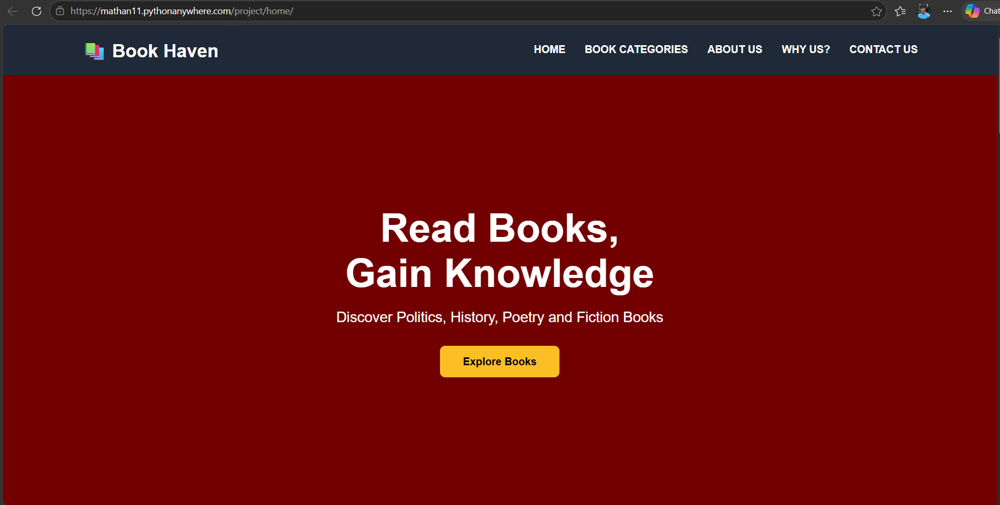
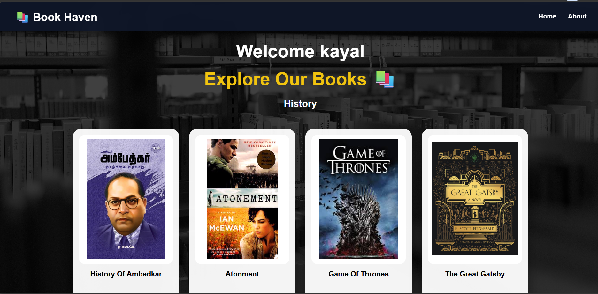
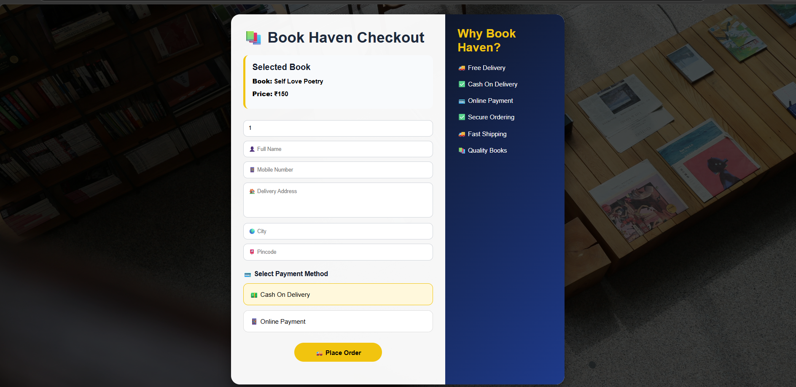
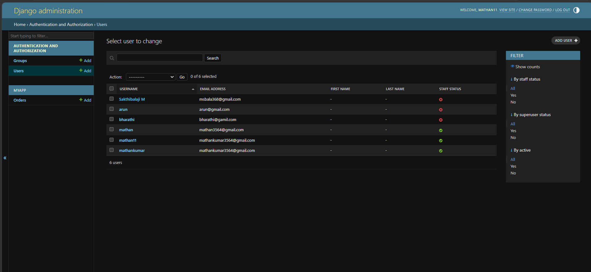

 📚 Book Store Management System

A full-stack online bookstore web application developed using Django, Python, HTML, CSS, and SQLite.

 🚀 Features

* User Registration & Authentication
* Secure Login & Logout System
* Place Orders Online
* Order Management System
* Admin Panel for Managing Books & Orders
* Responsive and User-Friendly Interface

## 📸 Project Screenshots

### Home Page

### About Page

### Books Page

### Signup Page

### Order Page

### User Details Page

### Users Page

### Admin Orders Page

🛠️ Technologies Used

* Python
* Django
* HTML5
* CSS3
* SQLite

 📂 Project Structure

* myapp/ – Application logic
* templates/ – HTML templates
* static/ – CSS and Images
* myproject/ – Django project settings

 ▶️ Installation
git clone https://github.com/Mathankumar-k-110904/book-store-django.git

cd book-store-django

python manage.py migrate

python manage.py runserver

👨‍💻 Author

Mathan Kumar K

Aspiring Backend Developer | Python & Django Enthusiast
